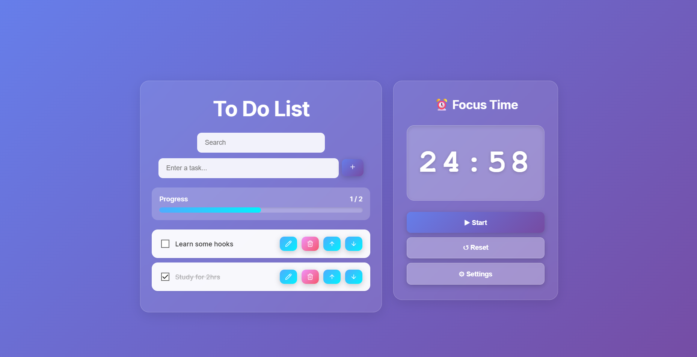

# To-Do List + Pomodoro Timer

A full-stack productivity application that combines task management with the Pomodoro Technique to help users stay focused and organized.

## Features

- Create, edit, and delete tasks
- Pomodoro timer integration for focused work sessions
- User authentication 

## Tech Stack

**Frontend:**
- React.js
- React Router for navigation
- CSS for styling

**Backend:**
- Express.js
- JWT authentication for secure user sessions
- PostgreSQL/SQLite for database management

---
